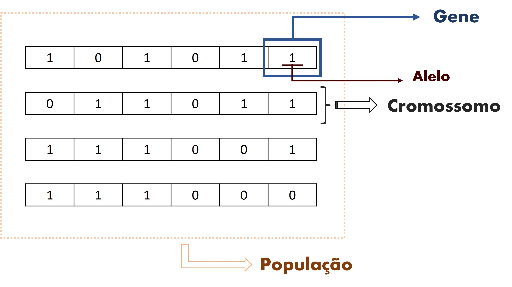
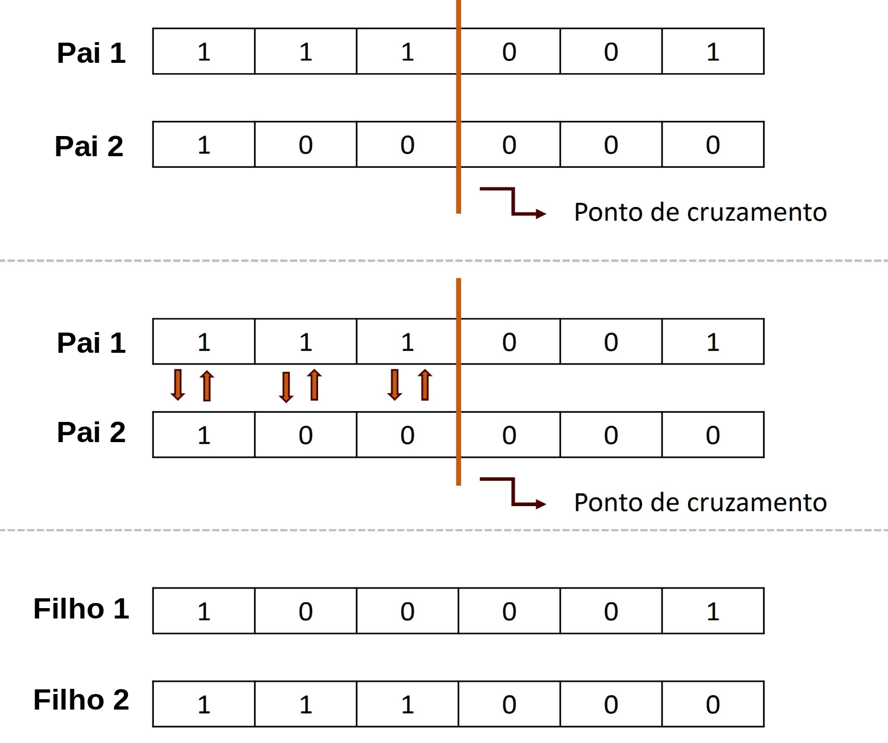
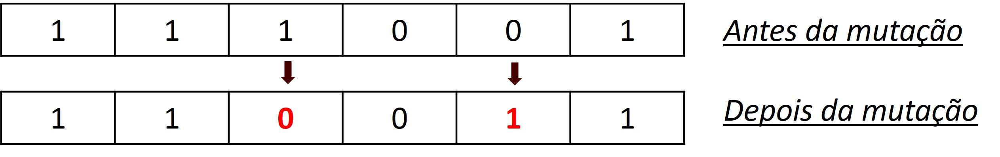

```{r, echo=FALSE, warning=FALSE, message=FALSE}

library(tidyverse)
library(htmltools)
library(htmlwidgets)
library(shiny)
library(kableExtra)

```

# Introdução

```{r Image, echo=FALSE}
htmltools::img(
  src = knitr::image_uri("assets/img/logo.png"), 
  alt = 'logo', 
  style = 'position:absolute; top:0; right:0px;  padding:10px;'
)
```


Um algoritmo genético está entre as heurísticas mais famosas, onde são realizados procedimentos de busca no espaço das soluções viáveis, utilizando regras probabilísticas para combinar soluções a fim de obter melhorias de qualidade. É um algoritmo inspirado na teoria da evolução natural de Charles Darwin. Este algoritmo reflete o processo de seleção natural onde os indivíduos mais aptos são selecionados para reprodução a fim de produzir descendentes na próxima geração.

Cinco fases são consideradas em um algoritmo genético:

- População inicial
- Função de avaliação
- Seleção
- Cruzamento
- Mutação

Veremos cada uma dessas fases sendo implementadas utilizando a linguagem R e para exemplificar como funcionam os algoritmos genéticos, irei utilizar o exemplo clássico da mochila, onde devemos encher a mochila com diversos itens sem ultrapassar um determinado limite de peso, otimizando o valor de cada item carregado.

*Esses são os dados:*

```{r, echo=FALSE}
# Dados
itens <- c(
  "Capa de chuva",
  "Canivete",
  "Água mineral",
  "Luvas",
  "Saco de dormir",
  "Tenda",
  "Fogão portátil",
  "Comida enlatada",
  "Laches"
)

pesos <- c(2, 1, 6, 1, 4, 9, 5, 8, 3)
pontos_sobrevivencia <- c(5, 3, 15, 5, 6, 18, 8, 20, 8)

dados <- data.frame(itens, pesos, pontos_sobrevivencia)

colnames(dados) <- c('Itens', 'Pesos (Kg)', 'Pontos de sobrevivência')

kable(dados)
```

Em algoritmos genéticos trabalhamos com aleatoriedade, sendo assim, para que os resultados sejam sempre os mesmos devemos definir uma semente.

```{r, echo=TRUE}
# Definindo uma semente 
set.seed(17)
```

*Definindo os objetos.*

```{r, echo=TRUE}
# Criando as classes
setClass(
  "Solucao", # Possíveis soluções para o problema
  slots = c(
    pesos = "numeric",
    pontos_sobrevivencia = "numeric",
    limite_peso = "numeric",
    nota_avaliacao = "numeric",
    peso_total = "numeric",
    geracao = "numeric",
    cromossomo = "character"
  ),
  prototype = list(
    pesos = 0,
    pontos_sobrevivencia = 0,
    limite_peso = 0,
    nota_avaliacao = 0,
    geracao = 0
  )
)

setClass(
  "algoritmoGenetico",
  slots = c( # Atributos da classe
    tamanho_populacao = "numeric",
    populacao = "list",
    geracao = "numeric",
    melhor_solucao = "Solucao",
    lista_solucoes = "list"
  )
)
```


## População Inicial

```{r popoulacao_inicial, echo=FALSE, fig.cap='', fig.align='center', out.width='50%'}

```

O processo começa com um conjunto de indivíduos denominado População. Cada indivíduo é uma possível solução para o problema que desejamos resolver.
Um indivíduo é caracterizado por um conjunto de parâmetros conhecido como Genes. Os genes são unidos em uma string para formar um cromossomo (solução).


```{r, echo=TRUE}
# Criando as funções para iniciar a população

gerar_cromossomo <- function(tamanho_cromossomo) {
  cromossomo <- sample(
    x = c("0", "1"), 
    size = tamanho_cromossomo, 
    replace = T
  ) 
  
  return(cromossomo)
}


inicializa_populacao <- function(algoritmo_genetico, pesos, pontos_sobrevivencia, limite) {
  for (i in 1:algoritmo_genetico@tamanho_populacao) {
    algoritmo_genetico@populacao[[i]] <- 
      new(
        "Solucao", 
        pesos = pesos,
        pontos_sobrevivencia = pontos_sobrevivencia,
        limite_peso = limite
      )
    
    algoritmo_genetico@populacao[[i]]@cromossomo <- gerar_cromossomo(length(pesos))
    
  }
  
  return(algoritmo_genetico)
}
```


## Função de avaliação

A função de avaliação ou também conhecida como função fitness, determina o quão apto um indivíduo está. Ela dá uma pontuação de aptidão para cada indivíduo. A probabilidade de um indivíduo ser selecionado para reprodução é baseada em sua pontuação de aptidão.

```{r, echo=TRUE}
# Como critério de avaliação será utilizado o ponto de sobrevivência
avaliacao <- function(solucao) {
  nota <- 0
  soma_pesos <- 0
  for (i in 1:length(solucao@cromossomo)) {
    if (solucao@cromossomo[i] == '1') {
      nota <- nota + solucao@pontos_sobrevivencia[i]
      soma_pesos <- soma_pesos + solucao@pesos[i]
    }
  }
  
  if (soma_pesos > solucao@limite_peso) {
    nota = 1
  }
  
  solucao@nota_avaliacao <- nota
  solucao@peso_total <- soma_pesos
  
  return(solucao)
}
```

## Seleção

A ideia da fase de seleção é selecionar os indivíduos mais aptos e deixá-los passar seus genes para a próxima geração.
Dois pares de indivíduos ( pais ) são selecionados com base em suas pontuações de aptidão. Indivíduos com alta aptidão têm mais chance de serem selecionados para reprodução.

```{r, echo=TRUE}
# Será utilizando o método da roleta viciada para selecionar os pais
soma_avaliacoes <- function(algoritmo_genetico) {
  soma <- 0
  for (solucao in algoritmo_genetico@populacao) {
    soma = soma + solucao@nota_avaliacao
  }
  
  return(soma)
}

selecao_roleta <- function(algoritmo_genetico, soma_avaliacoes) { # Método da roleta viciada
  pai <- 0
  valor_sorteado <- runif(1, min = 0, max = 1) * soma_avaliacoes
  soma <- 0
  i <- 1
  while (i < length(algoritmo_genetico@populacao) & soma < valor_sorteado) {
    soma <- soma + algoritmo_genetico@populacao[[i]]@nota_avaliacao
    pai <- pai + 1
    i <- i + 1
  }
  
  return(pai)
}

```

## Cruzamento

```{r crossover, echo=FALSE, fig.cap='', fig.align='center', out.width='50%'}

```

O Cruzamento ou crossover é a fase mais significativa em um algoritmo genético. Para cada par de pais a serem acasalados, um ponto de cruzamento é escolhido aleatoriamente de dentro dos genes. Onde os filhos são criados pela troca dos genes dos pais até que o ponto de cruzamento ser alcançado. E esses novos descendentes são adicionados à população.

```{r, echo=TRUE}
crossover <- function(solucao_a, solucao_b) {
  indices <- 1:length(solucao_a@cromossomo)
  corte <- sample(indices, 1)
  
  # cat("\nPonto de corte:", corte)
  
  if (corte == length(solucao_a@cromossomo)) {
    filho1 <- solucao_b@cromossomo[1:corte]
    filho2 <- solucao_a@cromossomo[1:corte]
  } else {
    filho1 <- c(solucao_b@cromossomo[1:corte], solucao_a@cromossomo[(corte+1):length(solucao_a@cromossomo)])
    filho2 <- c(solucao_a@cromossomo[1:corte], solucao_b@cromossomo[(corte+1):length(solucao_b@cromossomo)])
  }
  
  filhos <- list( # Construtor
    new(
      "Solucao", 
      pesos = solucao_a@pesos,
      pontos_sobrevivencia = solucao_a@pontos_sobrevivencia,
      limite_peso = solucao_a@limite_peso,
      geracao = solucao_a@geracao + 1,
      cromossomo = filho1
    ),
    new(
      "Solucao", 
      pesos = solucao_b@pesos,
      pontos_sobrevivencia = solucao_b@pontos_sobrevivencia,
      limite_peso = solucao_b@limite_peso,
      geracao = solucao_b@geracao + 1,
      cromossomo = filho2
    )
  )
  
  return(filhos)
  
}
```

## Mutação

```{r mutacao, echo=FALSE, fig.cap='', fig.align='center', out.width='50%'}

```

Em certos novos descendentes formados, alguns de seus genes podem ser submetidos a uma mutação com baixa probabilidade aleatória. Isso implica que alguns dos genes do cromossomo podem ser invertidos.


```{r, echo=TRUE}
mutacao <- function(solucao, taxa_mutacao) {
  for (i in 1:length(solucao@cromossomo)) {
    if (runif(n = 1, min = 0, max = 1) < taxa_mutacao) {
      if (solucao@cromossomo[i] == '1') {
        solucao@cromossomo[i] <- '0'
      } else {
        solucao@cromossomo[i] <- '1'
      }
    }
  }
  
  return(solucao)
}
```

E a cada geração será gerada diversas possíveis soluções para o problema, assim devemos escolher a melhor solução em cada geração e posteriormente a melhor solução de todas.

```{r, echo=TRUE}

ordena_populacao <- function(populacao) {
  populacao_ordenada <- c()
  notas_avaliacao <- c()
  for (solucao in populacao) {
    notas_avaliacao <- c(notas_avaliacao, solucao@nota_avaliacao)
  }
  lista_posicao <- order(notas_avaliacao, decreasing = T)
  for (i in 1:length(lista_posicao)) {
    populacao_ordenada <- c(populacao_ordenada, populacao[[lista_posicao[i]]])
  }
  
  return(populacao_ordenada)
}

melhor_solucao <- function(algoritmo_genetico, solucao) {
  algoritmo_genetico@lista_solucoes <- c(
    algoritmo_genetico@lista_solucoes,
    solucao@nota_avaliacao
  )
  
  if (solucao@nota_avaliacao > algoritmo_genetico@melhor_solucao@nota_avaliacao) {
    algoritmo_genetico@melhor_solucao <- solucao
  }
  
  return(algoritmo_genetico)
}


# Visualizar a melhor solução de cada geração
visualiza_geracao <- function(algoritmo_genetico) {
  melhor <- algoritmo_genetico@populacao[[1]]
  cat(
    "\n- Geração:", melhor@geracao, 
    "\nNota sobrevivência:", melhor@nota_avaliacao,
    "\nPeso total:", melhor@peso_total,
    "\nCromossomo:", melhor@cromossomo
    
  )
}


```


*Função principal do algoritmo genético:*

```{r, echo=TRUE}
resolver <- function(algoritmo_genetico, taxa_mutacao, num_geracoes, pesos, pontos_sobrevivencia, limite_peso) {
  ag <- algoritmo_genetico
  ag <- inicializa_populacao(
    algoritmo_genetico = ag,
    pesos = pesos,
    pontos_sobrevivencia = pontos_sobrevivencia,
    limite = limite_peso
  )
  
  for (i in 1:ag@tamanho_populacao) {
    ag@populacao[[i]] <- avaliacao(ag@populacao[[i]])
  }
  
  ag@populacao <- ordena_populacao(ag@populacao)
  ag@melhor_solucao <- ag@populacao[[1]]
  visualiza_geracao(algoritmo_genetico = ag) 
  
  for (i in 1:num_geracoes) {
    
    soma = soma_avaliacoes(algoritmo_genetico = ag)
    nova_populacao <- c()
    
    for(solucoes_geradas in 1:(ag@tamanho_populacao / 2)) {
      
      pai1 <- 1
      pai2 <- 1
      
      while (pai1 == pai2) {
        pai1   <- selecao_roleta(
          algoritmo_genetico = ag, 
          soma_avaliacoes = soma
        )
        
        pai2 <- selecao_roleta(
          algoritmo_genetico = ag, 
          soma_avaliacoes = soma
        )
      }
      
      # Combinando os pais e criando dois filhos
      filhos = crossover(
        solucao_a = ag@populacao[[pai1]],
        solucao_b = ag@populacao[[pai2]]
      )
      
      filho1 <- mutacao(
        solucao = filhos[[1]], 
        taxa_mutacao = 0.05
      )
      
      filho2 <- mutacao(
        solucao = filhos[[2]], 
        taxa_mutacao = 0.05
      )
      
      filhos_gerados <- c(filho1, filho2)
      
      nova_populacao <- c(nova_populacao, filhos_gerados)   
    }
    
    ag@populacao <- nova_populacao
    # Realizando a avaliação da nova população
    for (i in 1:ag@tamanho_populacao) {
      ag@populacao[[i]] <- avaliacao(ag@populacao[[i]])
    }
    
    ag@populacao <- ordena_populacao(ag@populacao)
    
    visualiza_geracao(algoritmo_genetico = ag) 
    
    ag <- melhor_solucao(
      algoritmo_genetico = ag,
      solucao = ag@populacao[[1]]
    )
  }
  
  
  cat(
    "\n----------------------------------", 
    "\n**** Melhor solução ***", 
    "\nGeração:", ag@melhor_solucao@geracao,
    "\nromossomo:", ag@melhor_solucao@cromossomo,
    "\nPeso total:", ag@melhor_solucao@peso_total,
    "\nPontos de sobrevivência:", ag@melhor_solucao@nota_avaliacao
  ) 
  
  return(ag)
  
}

```

*Resolvendo o problema da mochila:*

```{r, echo=TRUE}
itens <- c(
  "Capa de chuva",
  "Canivete",
  "Água mineral",
  "Luvas",
  "Saco de dormir",
  "Tenda",
  "Fogão portátil",
  "Comida enlatada",
  "Laches"
)

pesos <- c(2, 1, 6, 1, 4, 9, 5, 8, 3)
pontos_sobrevivencia <- c(5, 3, 15, 5, 6, 18, 8, 20, 8)

# -----------------

limite <- 25 # Limite da mochila
tamanho <- 20 # Tamanho da população
probabilidade_mutacao <- 0.05
numero_geracoes <- 50

ag <- new(
  "algoritmoGenetico",
  tamanho_populacao = tamanho
)

ag <- resolver(
  algoritmo_genetico = ag,
  taxa_mutacao = probabilidade_mutacao, 
  num_geracoes = numero_geracoes, 
  pesos = pesos, 
  pontos_sobrevivencia = pontos_sobrevivencia, 
  limite_peso = limite
)
```

***Quais os itens que deveriam ser levados na mochila?***

```{r, echo=TRUE}
peso_total <- 0
pontos <- 0
for (i in 1:length(itens)) {
  if (ag@melhor_solucao@cromossomo[i] == '1') {
    peso_total <- peso_total + pesos[i]
    pontos <- pontos + pontos_sobrevivencia[i]
    cat(
      "\nItem:", itens[i],
      " | Peso:", pesos[i],
      " | Pontos sobrevivência:", pontos_sobrevivencia[i]
    )
  }
}

cat(
  "\n-------------------------------------------",
  "\nPeso total:", peso_total, "- Pontos", pontos
) 
```


***Gráfico - Melhores soluções de cada geração:***

```{r, echo=TRUE}
plot(
  x = 1:numero_geracoes,
  y = ag@lista_solucoes,
  type = "l",
  main = "Acompanhamento das soluções",
  col = "blue",
  xlab = "Gerações",
  ylab = "Pontos sobrevivência"
)
```


# Pacote GA

A linguagem R já tem diversos pacotes para se trabalhar com o algoritmo genético, não sendo necessário programar todas as fases de um algoritmo genético, quando for trabalhar com esses pacotes será necessário criar somente a função de avaliação de acordo com o problema que estiver resolvendo.

```{r, echo=TRUE}

# install.packages(GA) # Instalando o pacote GA

library(GA)

itens <- c(
  "Capa de chuva",
  "Canivete",
  "Água mineral",
  "Luvas",
  "Saco de dormir",
  "Tenda",
  "Fogão portátil",
  "Comida enlatada",
  "Laches"
)
pesos <- c(2, 1, 6, 1, 4, 9, 5, 8, 3)
pontos_sobrevivencia <- c(5, 3, 15, 5, 6, 18, 8, 20, 8)

limite <- 25 # Limite da mochila

```

```{r, echo=TRUE}

avaliacao <- function(cromossomo) { 
  nota <- 0
  soma_pesos <- 0
  for (i in 1:length(cromossomo)) {
    if (cromossomo[i] == '1') {
      nota <- nota + pontos_sobrevivencia[i]
      soma_pesos <- soma_pesos + pesos[i]
    }
  }
  
  if (soma_pesos > limite) {
    nota = 1
  }
  
  return(nota)
}

```

```{r, echo=TRUE, warning=FALSE}

algoritmo <- ga(
  type = "binary",
  fitness = avaliacao,
  nBits = length(itens), # Quantidade de genes no cromossomo
  population = gabin_Population, # Função responsável por criar uma população inicial aleatória
  selection = gabin_rwSelection, # Método da roleta viciada
  crossover = gabin_spCrossover, # Operação com somente um ponto de corte
  mutation = gabin_raMutation, # Onde o que é zero virá um e o que for um vira zero
  popSize = 20,
  pcrossover = 0.8, # Porcentagem de casos que irá acontecer o crossover
  pmutation = 0.05,
  elitism = 0.05, # Probabilidade dos melhores individuos na próxima geração
  maxiter = 100,
  keepBest = TRUE, # Salva as melhores soluções de cada geração
  seed = 17 # Semente  
)

```


```{r, echo=TRUE}

summary(algoritmo)

```


```{r, echo=TRUE}
# Solução ótima
algoritmo@solution 

```

```{r, echo=TRUE}
# Melhor solução de cada geração - Visualizando as 6 primeiras
head(
  algoritmo@bestSol
)
```

***Quais os itens que deveriam ser levados na mochila?***

```{r, echo=TRUE}

peso_total <- 0
pontos <- 0
for (i in 1:length(itens)) {
  if (as.character(algoritmo@solution)[i] == '1') {
    peso_total <- peso_total + pesos[i]
    pontos <- pontos + pontos_sobrevivencia[i]
    cat(
      "\nItem:", itens[i],
      " | Peso:", pesos[i],
      " | Pontos sobrevivência:", pontos_sobrevivencia[i]
    )
  }
}

cat(
  "\n-------------------------------------------",
  "\nPeso total:", peso_total, "- Pontos", pontos
) 

```

#### Itens que deveriam ser levados na mochila 

```{r, echo=TRUE}

peso_total <- 0
pontos <- 0
for (i in 1:length(itens)) {
  if (as.character(algoritmo@solution)[i] == '1') {
    peso_total <- peso_total + pesos[i]
    pontos <- pontos + pontos_sobrevivencia[i]
    cat(
      "\nItem:", itens[i],
      "- Peso:", pesos[i],
      "- Pontos sobrevivência:", pontos_sobrevivencia[i]
    )
  }
}

cat(
  "\n-------------------------------------------",
  "\nPeso total:", peso_total, "- Pontos", pontos
) 

```

***Gráfico - Melhores soluções de cada geração:***

```{r, echo=TRUE}
plot(algoritmo) # Gráfico com as melhores soluções de cada geração
```


# Referências

-  **Curso:** [Algoritmo genético IA Expert](https://iaexpert.academy/courses/algoritmos-geneticos-r/)
- [Introduction to Genetic Algorithms](https://towardsdatascience.com/introduction-to-genetic-algorithms-including-example-code-e396e98d8bf3)
- [Problema da Mochila utilizando Algoritmos Genéticos](https://www.linkedin.com/pulse/problema-da-mochila-usando-algoritmos-gen%C3%A9ticos-victor-rabelo?trk=public_profile_article_view)
- **Livro:** *Pesquisa Operacional - Emerson C. Colin*
- **Livro:** *Otimização Combinatória e Meta-Heurísticas: Algoritmos e Aplicações - Marco Cesar Goldbarg / Elizabeth Gouvêa Goldbarg / Henrique Pacca Loureiro Luna*
